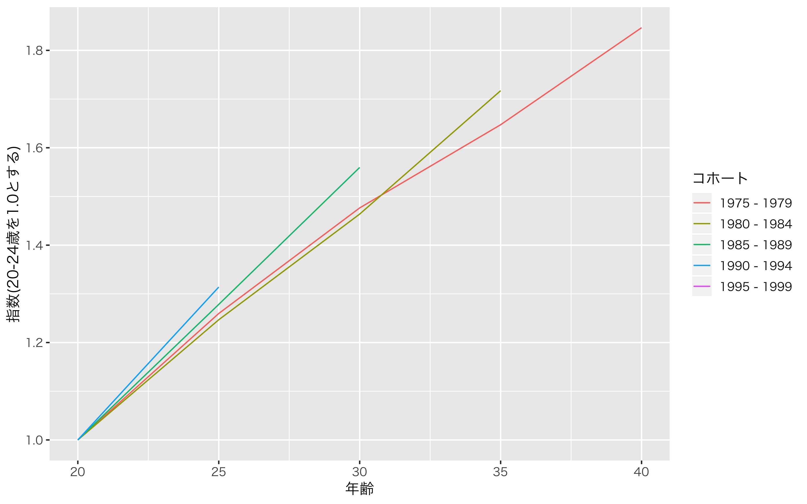

# サマリ
1975〜1990生まれの集団を５年毎のコホート集団に分けて、  
20〜24歳時点の実質賃金を1.0とし、年功に応じた賃金の上昇カーブを図示しました。

集計対象は男性のみ、学歴計・産業計・企業規模計。

# 動機
男女共同参画白書(平成15年 2003)では、[1940〜1969生まれの年功賃金カーブ](http://www.gender.go.jp/about_danjo/whitepaper/h15/danjyo/html/zuhyo/fig01_02_03_01.html)が図示されています。   これと同様のアプローチで1975〜1990生まれの年功賃金カーブを示してみることにしました。

# アウトプット

# データ
* 消費者物価指数(2015基準)  
https://www.stat.go.jp/data/cpi/historic.html
* 賃金構造基本統計調査(1999, 2004, 2009, 2014, 2019のデータを利用)  
https://www.e-stat.go.jp/stat-search/files?page=1&toukei=00450091&tstat=000001011429

賃金構造基本統計調査より「きまって支給する現金給与額」「年間賞与その他特別給与額」を収集し、前者は１年分の給与に換算するため12倍する。その上でこの２つの給与額の合計を名目上の賃金として扱うこととする。  
これを2015年基準の消費者物価指数で除することで、実質賃金として扱う。
基本的に[男女共同参画白書(平成15年 2003)](http://www.gender.go.jp/about_danjo/whitepaper/h15/danjyo/html/zuhyo/fig01_02_03_01.html)を参考に集計を行った。
